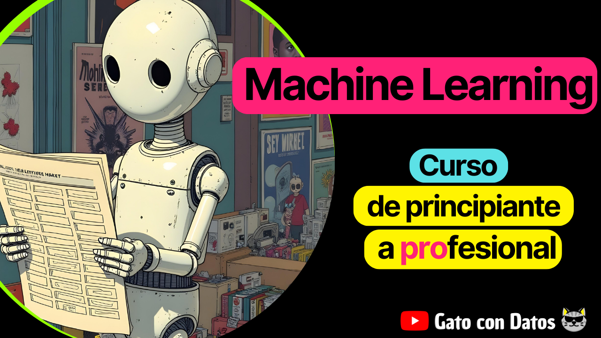

# Curso de Machine Learning: de principiante a profesional.

¡Bienvenido al repositorio de mi curso de Machine Learning! Aquí encontrarás los archivos con los que estaremos trabajando durante todo el curso. 

_**Nota:** Puedes seguir las explicaciones a través de mis videos en mi canal de Youtube **[@GatoconDatos](https://www.youtube.com/@gatocondatos/videos)**._

## Contenido del curso

1. Introducción al Machine Learning
2. Modelo de Regresión Lineal Simple

El curso se encuentra en pleno desarrollo. Una vez vaya publicando cada modulo, iré actualizando el contenido aquí.

[1]: https://www.youtube.com/@gatocondatos/videos

---
